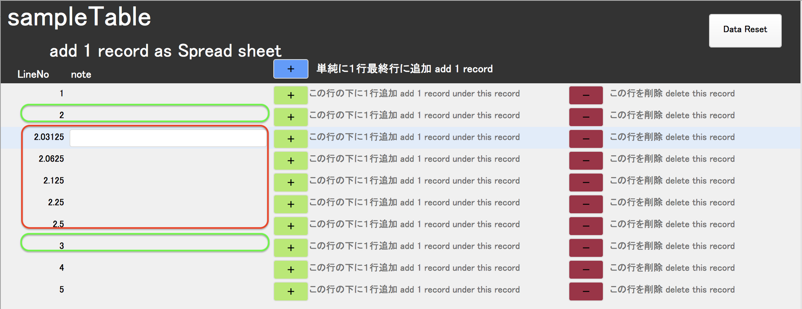
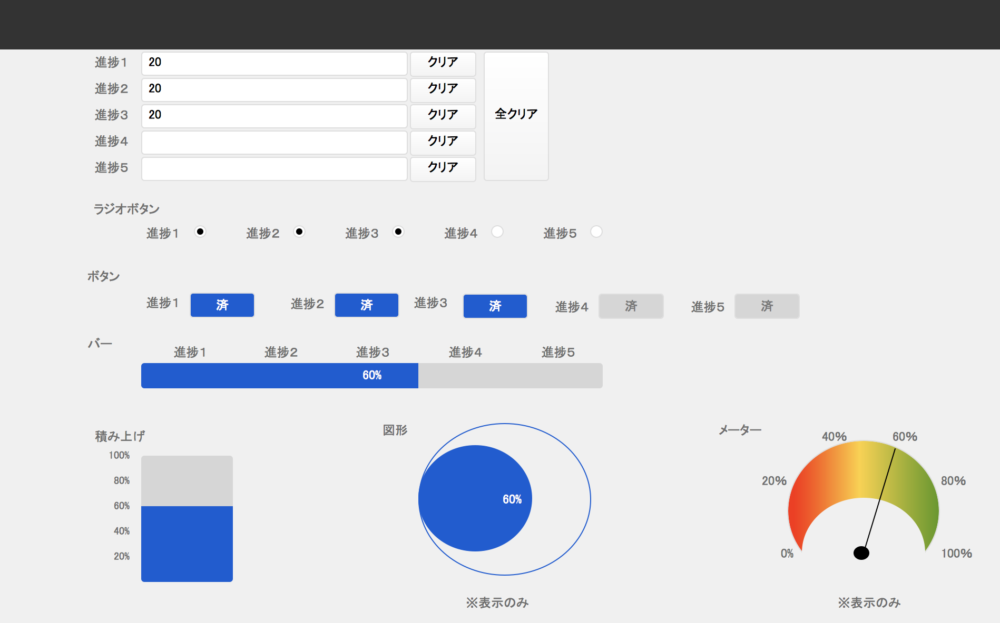
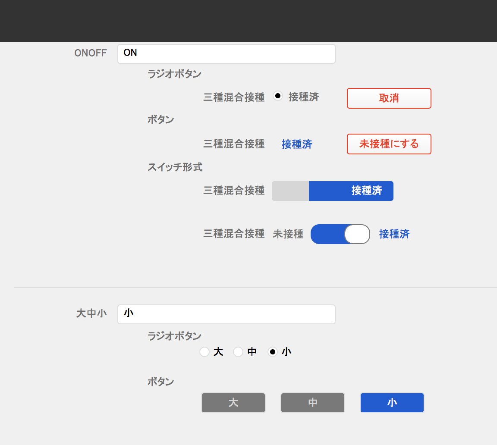
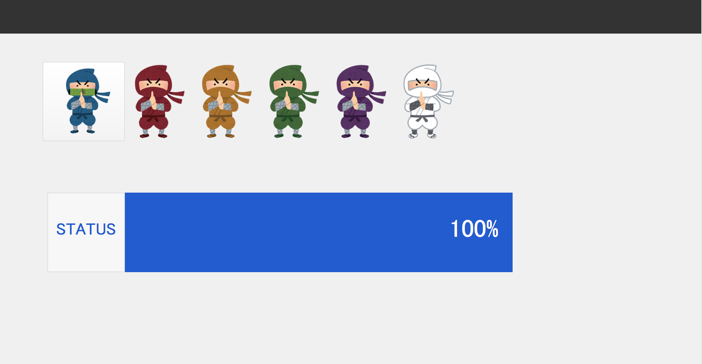

# FileMakerSample
FileMaker Sample Code Files

## Licence
[MIT](https://github.com/atsukosekiguchi/FileMakerSample/blob/master/LICENSE)
## Author
Guppy Web Service [atsukosekiguchi](https://github.com/atsukosekiguchi)

## Description
FileMaker Sample Files made by FileMaker Pro Advanced(ver.13 or later).  
These files work with FileMaker ver. 12 or later.

## Requirement
FileMaker Pro 12 or later

## Files
Sample_addLine.fmp12  
Sample_ButtonSwitchProgress.fmp12  
Sample_CloudAgencyTool.fmp12
Sample_ninja_status.fmp12

### Sample_addLine.fmp12
Add a line(record) like a spreadsheet.  
This file has been tested with ver13 and ver.17.  
  
行追加をスプレッドシートのように行の間に追加します。  
FileMaker ver.13とver.17でテスト済みです。  

### Sample_ButtonSwitchProgress.fmp12
This is a sample of the mounted buttons and switches and progress bar with FileMaker.
This file has been tested with ver13 and ver.17.

ファイルメーカー で実装されたボタンやスイッチや進捗バーのサンプルです。
FileMaker ver.13とver.17でテスト済みです。

### Sample_CloudAgencyTool.fmp12
It is an application to calculate fee of intermediary site.

### Sample_ninja_status.fmp12
This sample uses the “Pause/Resume Script” step.

「スクリプトの一時停止」ステップを活用したサンプルになります。
このステップはver.16以前と17以降ではエラー時の動きが違いますので、ご利用のFileMakerのバージョンによってはエラー処理を追加する必要があります。

This sample uses the “Pause/Resume Script” step.
In this step, the behavior at the time of error is different between ver.16 or earlier and after 17 or later, so it is necessary to add error handling depending on the version of FileMaker you are using.

